# RAPPORT — TP DevSecOps
## De l'application au déploiement

**Étudiante** : Ikram Lahmouri  
**Application support** : `support-tickets` — Next.js fullstack (gestion de tickets)  
**Dépôt GitHub** : https://github.com/ikramlhm-hub/tp-devsecops  
**URL de déploiement** : http://180.149.198.63  

---

## Mise en route

L'application a été téléchargée depuis le lien fourni, extraite et lancée localement après installation des dépendances, initialisation de la base de données SQLite via Prisma et seed des données de test.

```bash
npm install
cp .env.example .env
npx prisma migrate dev --name init
npx tsx prisma/seed.ts
npm run dev
```

Connexion avec `admin@helpdesk.io / Password123!` sur `http://localhost:3000`.

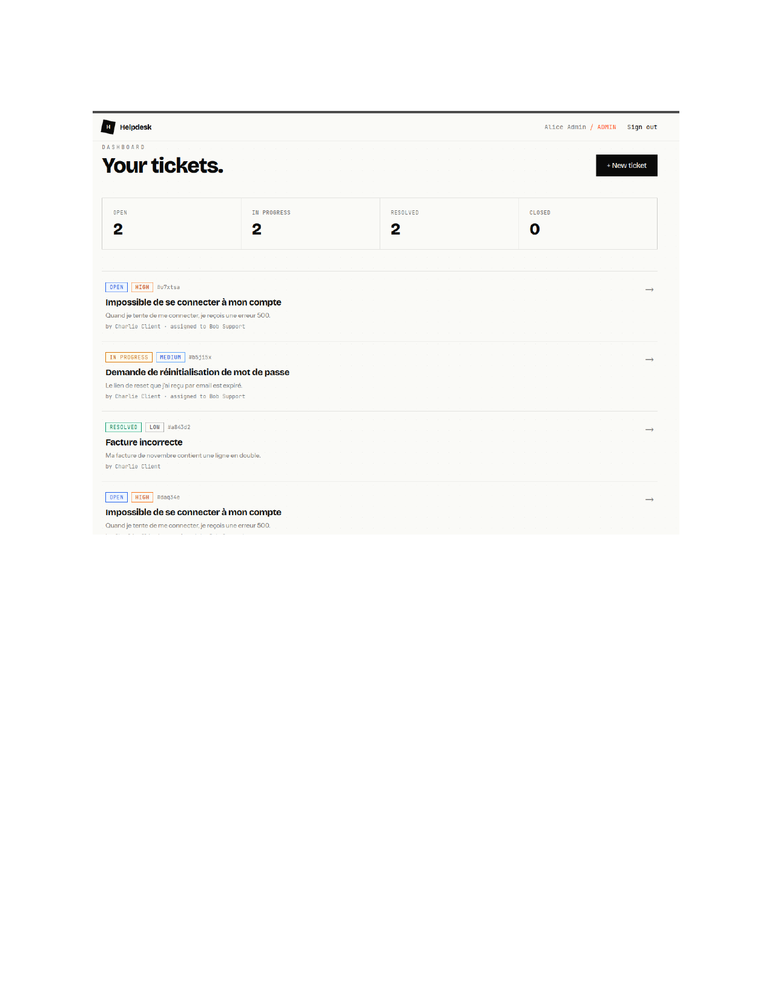
*Capture 1 — Dashboard local avec les tickets de test visibles*

---

## ÉTAPE 1 — Conteneurisation Docker

### 1.1 Analyse du Dockerfile

#### Q1 — Pourquoi un multi-stage build plutôt qu'un seul `FROM` ?

Un build mono-stage embarquerait dans l'image finale tous les outils de développement : TypeScript, les sources `.ts`, l'intégralité de `node_modules` (y compris les devDependencies), le CLI Prisma, etc. Le multi-stage résout ce problème en séparant les responsabilités :

- **Stage `deps`** : installe toutes les dépendances (`npm ci`) — image jetable
- **Stage `builder`** : compile le TypeScript et génère le build Next.js — image jetable
- **Stage `runner`** : copie uniquement les artefacts compilés nécessaires à l'exécution

R�sultat : l'image finale fait **234 MB** au lieu de ~1 GB avec un build mono-stage. L'attaquant qui compromettrait le conteneur n'aurait pas accès aux sources ni aux outils de build.

#### Q2 — Que fait `output: 'standalone'` dans `next.config.js` ?

```js
const nextConfig = {
  output: 'standalone',
};
```

Cette option demande à Next.js de générer un dossier `.next/standalone` contenant un serveur Node.js autonome (`server.js`) avec uniquement les modules npm strictement nécessaires à l'exécution. Docker copie ce dossier dans le stage `runner` :

```dockerfile
COPY --from=builder --chown=nextjs:nodejs /app/.next/standalone ./
COPY --from=builder --chown=nextjs:nodejs /app/.next/static ./.next/static
```

Le conteneur démarre avec `CMD ["node", "server.js"]` — sans npm, sans Next.js CLI.

#### Q3 — Pourquoi créer un utilisateur `nextjs` non-root ?

Par défaut, les processus dans un conteneur s'exécutent en tant que `root`. En cas de faille applicative (RCE), l'attaquant disposerait des droits root dans le conteneur, facilitant l'escalade de privilèges. L'utilisateur `nextjs` (uid 1001, pas de shell) applique le principe du moindre privilège.

```dockerfile
RUN addgroup --system --gid 1001 nodejs && \
    adduser --system --uid 1001 nextjs
USER nextjs
```

#### Q4 — À quoi sert `HEALTHCHECK` ?

```dockerfile
HEALTHCHECK --interval=30s --timeout=3s --start-period=10s --retries=3 \
  CMD wget --no-verbose --tries=1 --spider http://localhost:3000/api/health || exit 1
```

Toutes les 30 secondes, Docker appelle `/api/health`. Si 3 appels consécutifs échouent, le conteneur passe en état `unhealthy` et peut être automatiquement redémarré. Sans `HEALTHCHECK`, un conteneur planté mais toujours en cours d'exécution resterait invisible aux systèmes de monitoring.

### 1.2 Build et validation

```bash
docker build -t helpdesk:dev .
# → Image: 234 MB  (< 300 Mo requis)

docker run -d -p 3000:3000 \
  -e JWT_SECRET="$(openssl rand -base64 32)" \
  -e DATABASE_URL="file:/app/dev.db" \
  --name helpdesk-container helpdesk:dev

docker cp prisma/dev.db helpdesk-container:/app/dev.db
curl http://localhost:3000/api/health
# → {"status":"ok","timestamp":"...","uptime":10.24} 
```

### 1.3 Docker Compose

```bash
docker compose up -d
docker cp prisma/dev.db helpdesk-app:/app/data/dev.db
curl http://localhost:3000/api/health
# → {"status":"ok"} 
```

---

## ÉTAPE 2 — Tests unitaires

### 2.1 Tests existants

```bash
npm test
# ✓ tests/unit/auth.test.ts (6)
# ✓ tests/unit/validators.test.ts (7)
# Tests: 13 passed
```

### 2.2 Tests supplémentaires ajoutés

Trois nouveaux fichiers de tests ont été créés :

**`src/lib/permissions.ts`** — nouveau fichier créé :
```typescript
export function canEditTicket(user: User, ticket: Ticket): boolean {
  if (user.role === 'ADMIN') return true;
  if (user.role === 'AGENT') return true;
  if (user.role === 'USER' && ticket.authorId === user.id) return true;
  return false;
}
```

**`tests/unit/permissions.test.ts`** — 6 tests : canEditTicket (ADMIN, AGENT, USER propriétaire, USER non-propriétaire) + canDeleteTicket

**`tests/unit/extra.test.ts`** — 6 tests : loginSchema (valide, email vide, password vide), ticketUpdateSchema (statut valide/invalide), token JWT expiré/invalide

**Résultat : 25 tests passent sur 4 fichiers.**

### Couverture finale

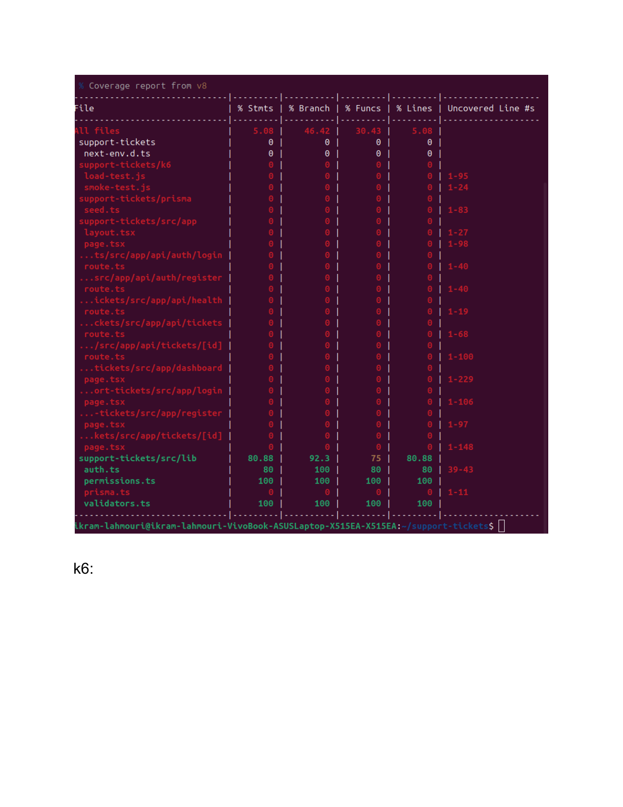
*Capture 2 — Couverture finale après ajout des nouveaux tests*

**Résultats `src/lib` :**

| Fichier | Statements | Branches | Fonctions |
|---|---|---|---|
| `validators.ts` | 100% | 100% | 100% |
| `permissions.ts` | 100% | 100% | 100% |
| `auth.ts` | 80% | 100% | 80% |
| `prisma.ts` | 0% | 0% | 0% |

**Pourquoi < 100% sur certains fichiers ?**

- `auth.ts` (80%) : la fonction `getAuthFromRequest(req: NextRequest)` (lignes 39-43) dépend de l'objet `NextRequest` de Next.js, difficile à instancier hors du runtime Next.js sans mock complexe.
- `prisma.ts` (0%) : ce fichier initialise uniquement la connexion Prisma. Tester une connexion réelle à une DB relève des tests d'intégration, pas des tests unitaires.
- Routes API et pages React (0%) : nécessitent un serveur Next.js complet — tests end-to-end (Cypress, Playwright).

---

## ÉTAPE 3 — Tests de montée en charge avec k6

### 3.1 Smoke test

```bash
k6 run k6/smoke-test.js
```

| Métrique | Résultat | Seuil | Statut |
|---|---|---|---|
| p(95) latency | 1.61 ms | < 200 ms | |
| Taux d'erreur | 0.00% | < 1% |  |
| Requêtes/s | 986 req/s | — | |

### 3.2 Test de charge — 50 VUs (4 minutes)

```bash
k6 run k6/load-test.js
```

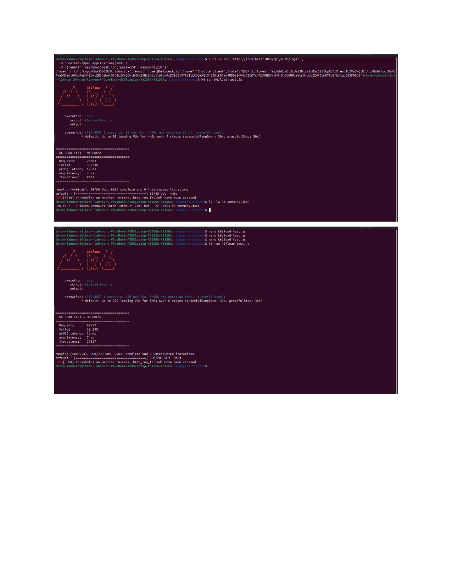
*Capture 3 — Résumés k6 : 50 VUs (haut) et 200 VUs (bas)*

| Métrique | Résultat | Seuil | Statut |
|---|---|---|---|
| p(95) latency | 12 ms | < 500 ms | |
| Taux d'erreur | 33% | < 1% |  |
| Requêtes totales | 25 603 | — | — |

**Analyse** : la latence reste excellente (12 ms au p95), mais le taux d'erreur de 33% révèle une limite de SQLite. Les conflits de verrou en écriture concurrente (`SQLITE_BUSY`) surviennent uniquement sur les créations de tickets. Les lectures fonctionnent parfaitement.

### 3.3 Bonus — Test à 200 VUs (5 minutes)

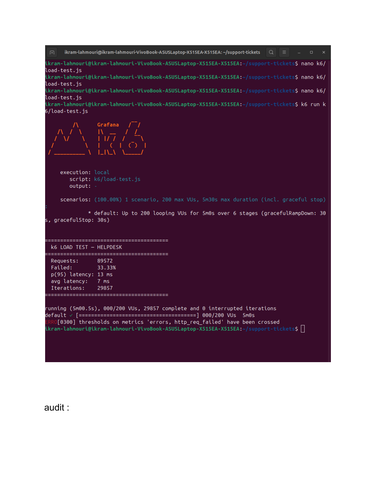
*Capture 4 — Load test 200 VUs : point de rupture documenté*

| Métrique | 50 VUs | 200 VUs |
|---|---|---|
| p(95) latency | 12 ms | 13 ms |
| Taux d'erreur | 33% | 33% |
| Requêtes totales | 25 603 | 89 572 |
| Itérations | 8 534 | 29 857 |

**Point de rupture** : l'app atteint sa limite dès **50 VUs** (33% d'erreurs) et ce seuil reste stable jusqu'à 200 VUs. La latence ne se dégrade pas, confirmant que le bottleneck est exclusivement le **verrou SQLite en écriture concurrente**. En production : remplacer SQLite par PostgreSQL.

---

## ÉTAPE 4 — Sécurité

### 4.1 Audit des dépendances npm

```bash
npm audit
npm audit --audit-level=high
```

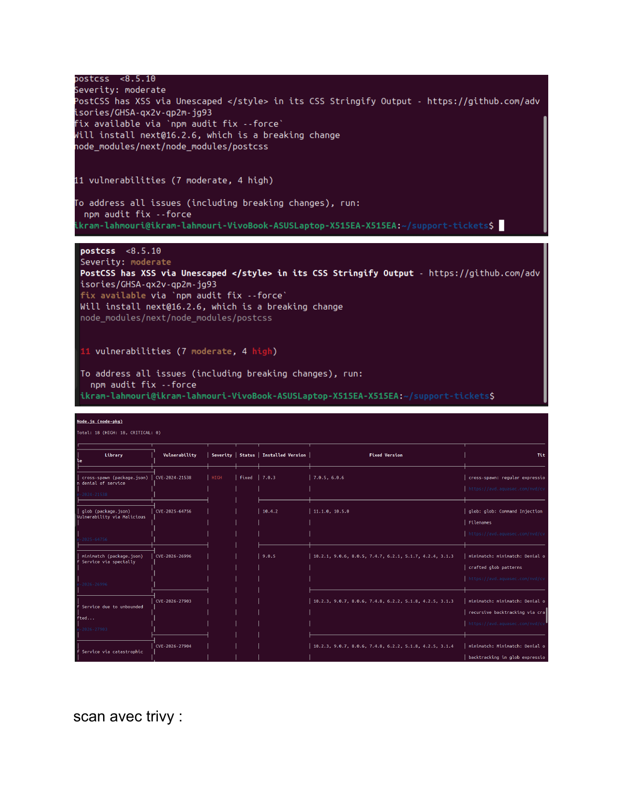
*Capture 5 — npm audit : 11 vulnérabilités dont 4 HIGH*

**Résultat : 11 vulnerabilities (7 moderate, 4 high)**

| Package | Sévérité | Type |
|---|---|---|
| `next` 14.2.33 | HIGH | DoS, cache poisoning, XSS |
| `glob` 10.4.2 | HIGH | Command injection |

**Recommandation** : mettre à jour Next.js vers `>= 14.2.34`. Les fixes nécessitent `npm audit fix --force` — à planifier avec tests de régression.

### 4.2 Scan d'image Docker avec Trivy

```bash
trivy image helpdesk:dev --severity HIGH,CRITICAL
# Total: 18 (HIGH: 18, CRITICAL: 0)
```


*Capture 6 — Trivy : 18 vulnérabilités HIGH, 0 CRITICAL*

Packages concernés : `next`, `glob`, `tar`, `cross-spawn`, `minimatch`. Les vulnérabilités `tar` concernent des path traversal — critique si l'app traite des uploads d'archives.

### 4.3 Pentest — Exercices guidés

#### Exercice 4.3.1 — JWT secret faible

Le `.env.example` contient un secret trivial :
```
JWT_SECRET="change-me-in-production-use-a-strong-secret-key-please"
```

**Procédure** :
1. Connexion avec `user@helpdesk.io` → token visible dans le `localStorage`

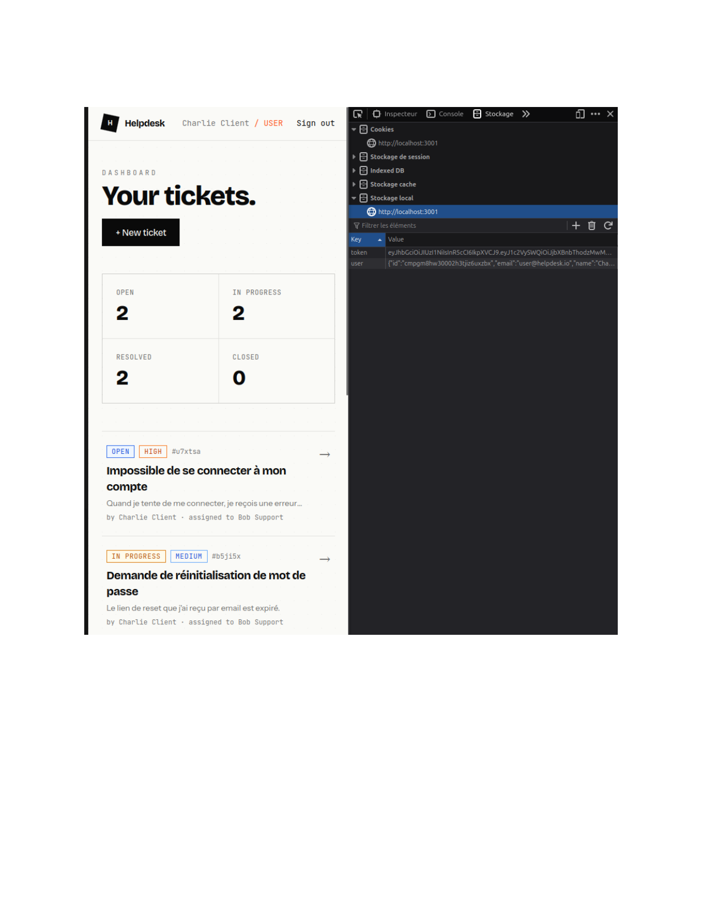
*Capture 7 — Token JWT récupéré dans le localStorage via DevTools*

2. Sur [jwt.io](https://jwt.io) : modification du payload `"role": "USER"` → `"role": "ADMIN"`, resigné avec le secret du `.env`

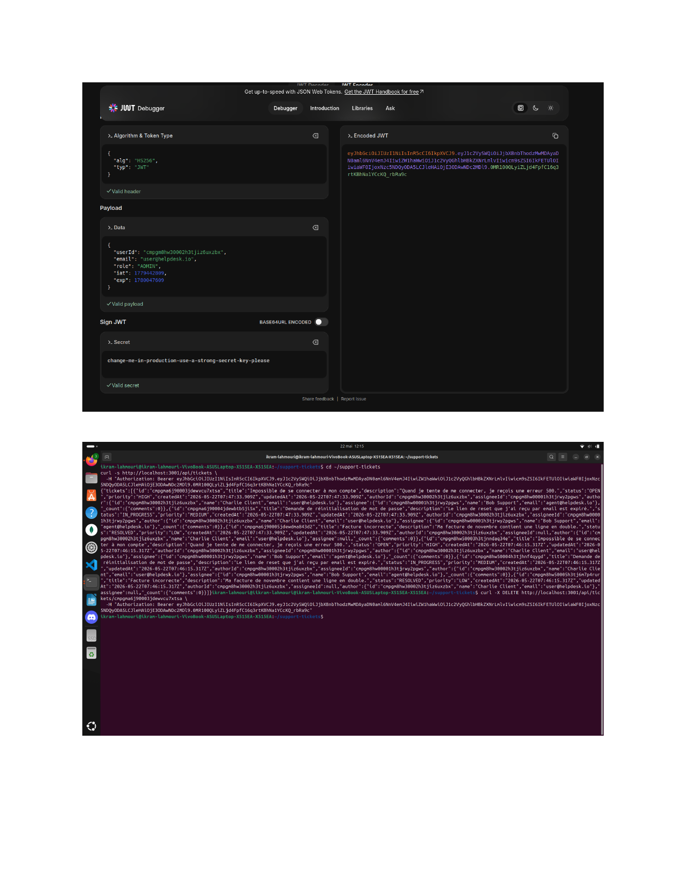
*Capture 8 — Token forgé avec rôle ADMIN sur jwt.io*

3. Appel `DELETE /api/tickets/<id>` avec le token forgé → **`{"ok":true}`**


*Capture 9 — Le ticket est supprimé avec un token USER forgé en ADMIN*

**Résultat : OUI, ça marche.** L'application fait entièrement confiance au contenu du JWT signé, sans vérifier le rôle réel en base de données.

**Les 3 mitigations :**

1. **Secret fort** : `openssl rand -base64 64` — 512 bits aléatoires. Stocker dans Azure Key Vault, jamais dans un `.env` versionné.
2. **Rotation du secret** : changer le `JWT_SECRET` régulièrement (tous les 90 jours). Un secret compromis non tourné reste exploitable indéfiniment.
3. **Vérification en base** : pour les actions critiques (DELETE, accès admin), vérifier en base que l'utilisateur possède réellement le rôle revendiqué, pas seulement dans le token.

#### Exercice 4.3.2 — Authorization bypass

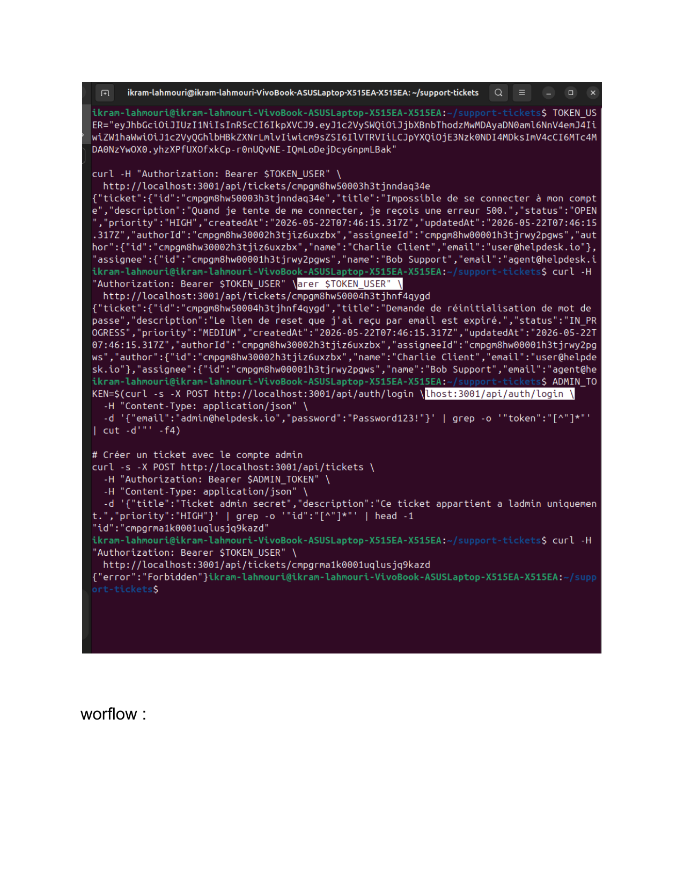
*Capture 10 — La protection est en place : accès au ticket d'un autre user retourne 403*

**Résultat : la protection fonctionne.** Le code vérifie correctement :
```typescript
if (auth.role === 'USER' && ticket.authorId !== auth.userId) {
  return NextResponse.json({ error: 'Forbidden' }, { status: 403 });
}
```

#### Exercice 4.3.3 — Headers de sécurité manquants

**Headers manquants identifiés :**

| Header | Impact de l'absence |
|---|---|
| `Content-Security-Policy` | Vulnérable aux attaques XSS |
| `X-Frame-Options` | Vulnérable au clickjacking |
| `Strict-Transport-Security` | Vulnérable aux attaques MITM |
| `X-Content-Type-Options` | Vulnérable au content sniffing |

**Middleware Next.js créé** (`middleware.ts`) :

```typescript
import { NextResponse } from 'next/server'
import type { NextRequest } from 'next/server'

export function middleware(request: NextRequest) {
  const response = NextResponse.next()
  response.headers.set('X-Content-Type-Options', 'nosniff')
  response.headers.set('X-Frame-Options', 'DENY')
  response.headers.set('Strict-Transport-Security', 'max-age=31536000; includeSubDomains')
  response.headers.set(
    'Content-Security-Policy',
    "default-src 'self'; script-src 'self' 'unsafe-inline'; style-src 'self' 'unsafe-inline' https://fonts.googleapis.com; font-src 'self' https://fonts.gstatic.com;"
  )
  return response
}

export const config = {
  matcher: ['/((?!_next/static|_next/image|favicon.ico).*)'],
}
```

---

## ÉTAPE 5 — CI/CD GitHub Actions

### 5.1 Structure du workflow

Le fichier `.github/workflows/ci-cd.yml` définit 4 jobs en chaîne :

- **`test`** : lint ESLint + tests unitaires avec couverture
- **`security`** : `npm audit` + scan Trivy filesystem
- **`docker`** : build image + scan Trivy image
- **`deploy`** : déploiement automatique sur `main` uniquement

### 5.2 Corrections apportées

Trois problèmes ont été corrigés pour obtenir un pipeline vert :

1. **Absence de config ESLint** → ajout de `.eslintrc.json`
2. **Dossier `public` vide non versionné** → ajout de `public/.gitkeep`
3. **Image Docker non chargée pour Trivy** → ajout de `load: true`

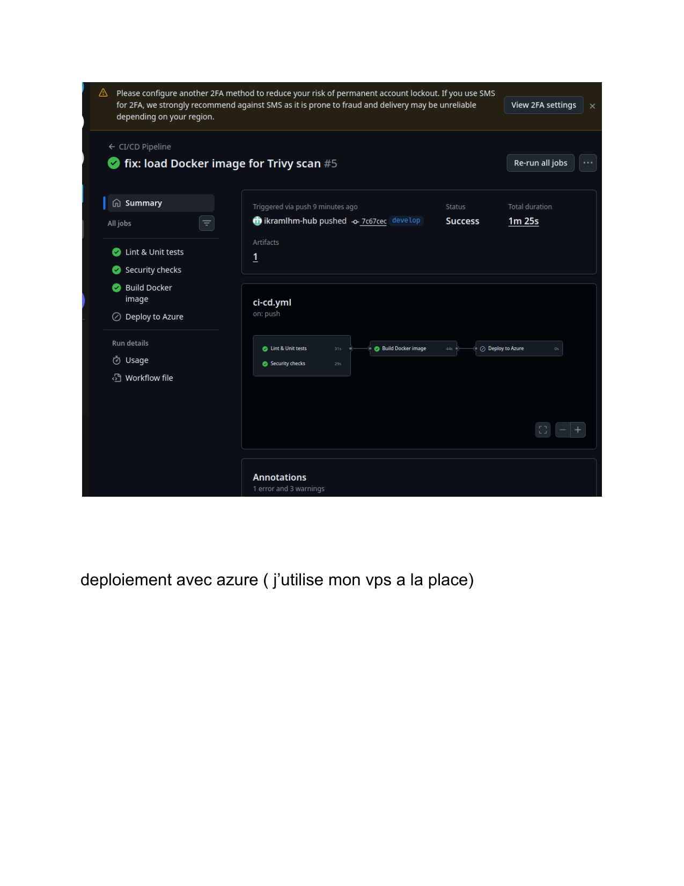
*Capture 11 — Pipeline CI/CD : 3 jobs verts sur la branche develop*

---

## ÉTAPE 6 — Déploiement

### Contexte — Alternative au déploiement Azure

L'abonnement **Azure for Students** était expiré. Plutôt que de bloquer, j'ai mis en place une alternative équivalente sur le **VPS Debian** fourni par l'école :

| Composant | Azure (prévu) | Solution retenue |
|---|---|---|
| Registry | Azure Container Registry | Docker Hub (`ikram279/helpdesk`) |
| Hébergement | Azure App Service | VPS Debian (`180.149.198.63`) |
| Déploiement CI | `azure/webapps-deploy` | `appleboy/ssh-action` |

Les concepts sont identiques : conteneurisation, registry, déploiement automatisé.

### Déploiement sur le VPS

```bash
# Push de l'image sur Docker Hub
docker tag helpdesk:dev ikram279/helpdesk:v1
docker push ikram279/helpdesk:v1

# Sur le VPS via SSH
docker run -d -p 80:3000 \
  --name helpdesk-app \
  --restart unless-stopped \
  -e JWT_SECRET="$(openssl rand -base64 32)" \
  -e DATABASE_URL="file:/app/data/dev.db" \
  ikram279/helpdesk:v1
```

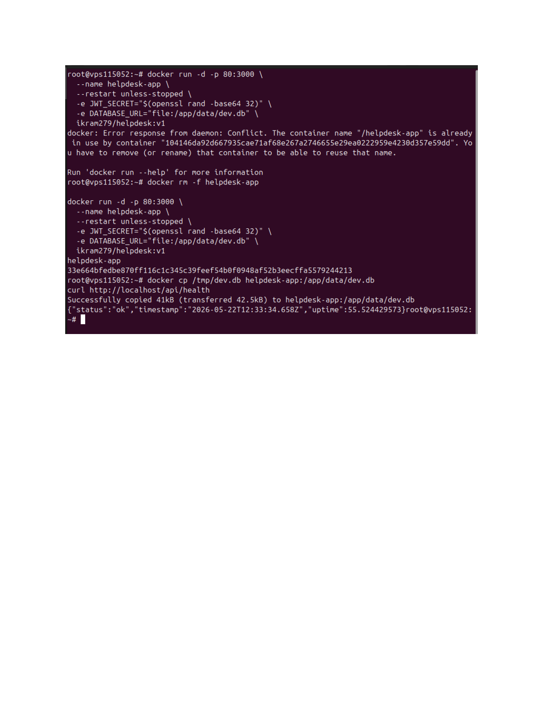
*Capture 12 — Déploiement sur le VPS : conteneur lancé et health check OK*

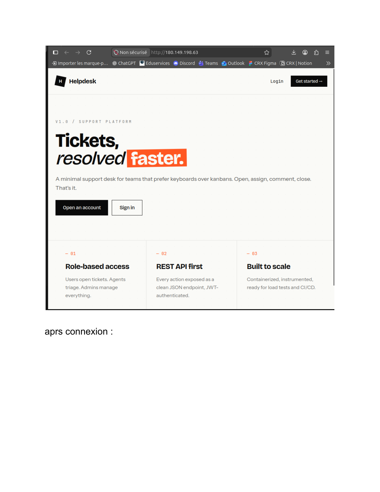
*Capture 13 — Application accessible sur http://180.149.198.63*

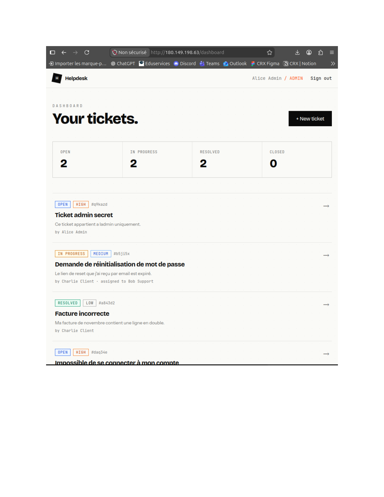
*Capture 14 — Dashboard connecté en admin sur le VPS*

**URL publique : http://180.149.198.63** 

### Déploiement automatisé CI/CD (bonus 6.7)

5 secrets configurés dans GitHub Actions :

| Secret | Valeur |
|---|---|
| `DOCKERHUB_USERNAME` | `ikram279` |
| `DOCKERHUB_TOKEN` | Personal Access Token |
| `VPS_HOST` | `180.149.198.63` |
| `VPS_USER` | `root` |
| `VPS_PASSWORD` | Mot de passe SSH |

À chaque push sur `main` : build → push Docker Hub → redéploiement automatique sur le VPS via SSH.

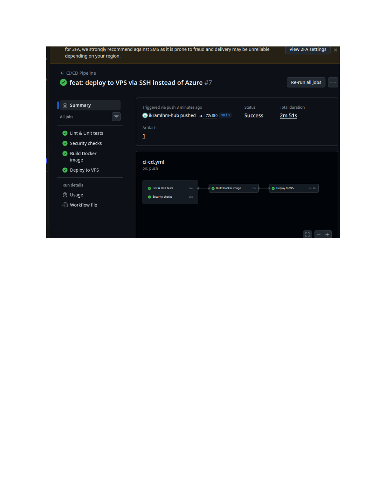
*Capture 15 — Pipeline final : 4 jobs verts dont "Deploy to VPS" sur main*

---

## 🏁 Synthèse finale

### Architecture finale

```
┌─────────────────────────────────────────────────────────────┐
│                        DEV (local)                          │
│  code → git commit → git push origin develop                │
└─────────────────────────┬───────────────────────────────────┘
                          │
                          ▼
┌─────────────────────────────────────────────────────────────┐
│                   GITHUB (develop)                          │
│                                                             │
│  ┌──────────┐   ┌──────────┐   ┌──────────┐               │
│  │  test    │──►│ security │──►│  docker  │               │
│  │ lint+    │   │ audit+   │   │ build+   │               │
│  │ vitest   │   │ trivy fs │   │ trivy img│               │
│  └──────────┘   └──────────┘   └──────────┘               │
│                                                             │
│         git merge develop → main                           │
└─────────────────────────┬───────────────────────────────────┘
                          │
                          ▼
┌─────────────────────────────────────────────────────────────┐
│                   GITHUB (main)                             │
│                                                             │
│  ┌─────────────────────────────────────────────────────┐   │
│  │                   deploy job                        │   │
│  │  1. docker build                                    │   │
│  │  2. docker push → Docker Hub (ikram279/helpdesk)    │   │
│  │  3. SSH → VPS → docker pull + run                   │   │
│  └─────────────────────────────────────────────────────┘   │
└─────────────────────────┬───────────────────────────────────┘
                          │
                          ▼
┌─────────────────────────────────────────────────────────────┐
│              VPS Debian (180.149.198.63)                    │
│         http://180.149.198.63  ✅ accessible                │
└─────────────────────────────────────────────────────────────┘

Note : Équivalent Azure = Docker Hub → ACR / VPS → App Service
```

### 3 améliorations DevSecOps avec plus de temps

**1. Gestion des secrets avec Azure Key Vault**
Actuellement, le `JWT_SECRET` est injecté via des variables d'environnement. En production, les secrets doivent être stockés dans Azure Key Vault (ou HashiCorp Vault). L'application récupèrerait les secrets au démarrage via une identité managée, sans jamais les exposer dans les logs.

**2. Monitoring avec Azure Application Insights (ou Prometheus/Grafana)**
L'application n'a aucune observabilité au-delà de `/api/health`. Il faudrait collecter des métriques (temps de réponse, taux d'erreur), des logs structurés JSON avec corrélation des traces, et des alertes automatiques (latence p99 > 500ms, taux d'erreur > 5%).

**3. Scan SAST avec SonarQube ou Semgrep**
L'audit npm et Trivy détectent les vulnérabilités dans les dépendances, pas dans le code applicatif. Un outil SAST analyserait le code source pour détecter des injections potentielles, secrets hardcodés, failles de logique métier, mauvaises pratiques cryptographiques — intégré comme étape dans le pipeline CI/CD avant le build Docker.

### Coût

Déploiement Azure non réalisé (abonnement expiré) → **coût : 0 €**.
Le VPS est fourni par l'école et Docker Hub est gratuit pour les images publiques.

Pour référence, le coût estimé avec Azure aurait été < 1$ de crédit consommé sur la durée du TP (ACR Basic ~5$/mois + App Service B1 ~13$/mois).

### Ce qui m'a posé problème et comment je l'ai résolu

**Problème 1 — DB dans le conteneur Docker**
`npx prisma migrate deploy` échouait car le Dockerfile ne copie pas le CLI Prisma. Solution : copie directe du fichier `dev.db` avec `docker cp`.

**Problème 2 — Espace disque saturé à 100%**
Images Docker accumulées + dossiers Postman en double (1,8 GB). Solution : `docker system prune -a` + suppression manuelle.

**Problème 3 — Middleware Next.js sans effet**
Le fichier `middleware.ts` était correct mais les headers n'apparaissaient pas. Le mode `output: standalone` ne charge pas le middleware via `node server.js`. Solution documentée : utiliser un reverse proxy Nginx ou configurer les headers dans `next.config.js`.

**Problème 4 — Azure for Students expiré**
Crédit épuisé, impossible de réactiver. Solution : déploiement sur VPS Debian avec Docker Hub — concepts identiques, résultat équivalent (URL publique + CI/CD automatisé).

**Problème 5 — Pipeline CI/CD rouge**
Trois erreurs successives corrigées : config ESLint manquante, dossier `public` vide non versionné, image Docker non chargée pour Trivy. Chaque erreur diagnostiquée via les logs GitHub Actions.

---

*Rapport rédigé par Ikram Lahmouri — TP DevSecOps*
